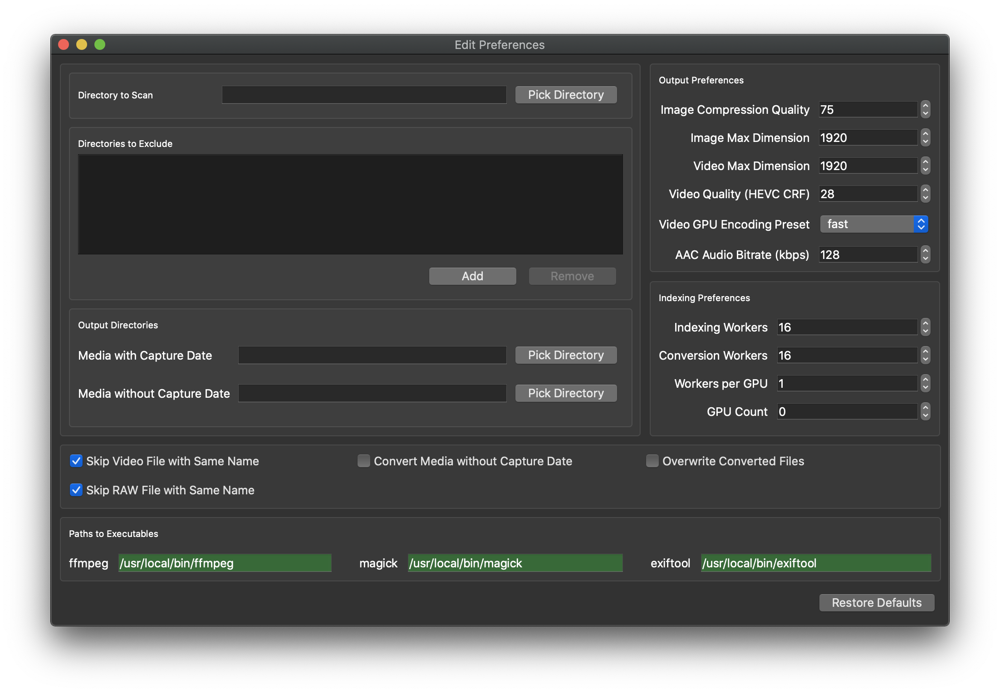

<p>
<a href="https://github.com/sabaatworld/batch-media-compressor/releases"></a>
<a href="https://github.com/sabaatworld/batch-media-compressor/releases"></a>
<a href="https://github.com/sabaatworld/batch-media-compressor/releases"></a>
</p>

# Introduction

Simple application to convert and compress all of your images and videos so that you can store them on mobile device and access them anywhere. It support a large variety or image and video formats (including RAW image formats). This application will compress all images to JPG and videos to MP4 (HEVC) accoring to the configured settings.

If you're like me and value the privacy of your personal images or videos (or maybe you just don't want to pay for services like Google Photos & Amazon Photos), but still want the benifits of being able to revisit you memories on your portable devices, the this app is sure to help. The aim of this project is to compress the entire image / video library to a small enough size that can by synced over to your phone or other porable devices. I shrunk down my 385GB image and video library to 27GB; which I put on my phone storage.

# Getting Started

Its super easy to get started:

1. Download and install [ExifTool](https://exiftool.org), [Image Magick](https://imagemagick.org/index.php) and [FFMPEG](https://ffmpeg.org).
    * On OSX, you need to additionally install **dcraw** and **ufraw** to support RAW image formats. On Windows, these are included with Image Magick.
    * It's easiest if you add there tools to you PATH environment variable so that Batch Media Compressor can access them without any configuration.
    * If you're unable to or don't want to add these to PATH, then feel free to configure the location of these tools in the **Edit Preferences** window.
1. Download the latest version of the app from the [releases](releases) page.
1. Select directories to scan and output directories using **Right-click on Tray Icon** -> **Edit Preferences**.
1. Start media compression using **Right-click on Tray Icon** -> **Start Processing**.



## Multithreading (Maximizing Conversion Speed)

Make sure that you have "worker" count is equal to the number of logical CPU cores.

If you want to offload video conversion to your **Nvidia GPU**, you will need to a version of **ffmpeg** that support hardware encoding. Since this type of ffmpeg binary is not distributable, you will need compile it from source. For windows, the easiest way to do this was [media-autobuild_suite](https://github.com/m-ab-s/media-autobuild_suite). However, there are many other options available as mentioned [ffmpeg compilation guide](https://trac.ffmpeg.org/wiki/CompilationGuide). Basically, you need "--enable-cuda-nvcc" / "--enable-libnpp" support in your ffmpeg binary, which in-turn requires [Nvidia's CUDA SDK](https://developer.nvidia.com/cuda-toolkit) to run.

Once you have ffmpeg setup, crank up the GPU count and workers to indicate that you want to convert videos using your GPU. I've tested parallel conversion on 2 X Nvidia GTX 1080 GPUs on my Windows 10 machine and they really accelerate the video conversion. Note that consumer GPUs like these only support a limited number of conversions in parallel so conversion will actually fail if you want to have more than one worker per GPU. To remove this restriction, apply this [nvidia-patch](https://github.com/keylase/nvidia-patch).

## Syncing Media to Portables

### Android

Although you could just copy over the compressed / converted files to your portable device, the best option is to setup [Syncthing](https://syncthing.net/) to automatially sync the converted files to your "DCIM" directory on your portable devices. This works on LAN as well over the internet.

### iOS

Use iTunes to sync photos and videos from the output directory. Note that for some reason iTunes needs more space on the device than the actual size of the compressed media. In the near future, I'll release an app to make things easier for iOS users.

# Developer Instructions

## VSCode Setup Instructions

1. Setup VSCode with Python extension (Tested with Python: 3.7.5)
1. Download python3 for Win. Do “brew install python3” for Mac.
1. Check `python3 --version` (mac) , `py -3 --version` (win)
1. Create project dir and open in VSCode
1. Select Python interpreter in VSCode
1. Create **virtual environment**

    * Mac

    ```bash
    python3 -m venv .venv
    source .venv/bin/activate
    ```

    * Win
      (If error then allow execution: Set-ExecutionPolicy -ExecutionPolicy RemoteSigned -Scope Process)

    ```bash
    py -3 -m venv .venv
    Set-ExecutionPolicy -ExecutionPolicy Bypass -Scope Process -Force
    .venv\scripts\activate
    ```

1. Download **ExifTool** (Tested with 11.76) binary - <https://www.sno.phy.queensu.ca/~phil/exiftool/>. Ensure `exiftool` is on PATH.
1. The requirements.txt file has been created using `pip freeze > requirements.txt`. Execute `pip install -r requirements.txt` to install the required packages.
1. Install **ImageMagick** (Tested with 7.0.9) - <http://docs.wand-py.org/en/0.5.7/guide/install.html>. Ensure "MAGICK_HOME" has been setup properly. Also ensure that RAW handling binaries are available; which can be checked by running `convert -list configure`.

    * Installing RAW support libraries on Mac

    ```bash
    brew install dcraw
    brew install ufraw
    ```

1. Install **ffmpeg** (Tested with 4.2.1) - <https://www.ffmpeg.org/download.html>. Make sure `ffmpeg` is on PATH.
1. Install **Qt Creator** (Tested with 5.12.x) if you want to change the UI - <https://www.qt.io/offline-installers>.

## Running the App

Simply launch ApplicationWindow.py in VSCode to start the application. This should pop up the main application window.

## Building Binary

### OSX

```
./packaging/build_osx.sh
```

### Windows

```
 .\packaging\build_win.bat <PATH_TO_PFX_FILE>
```
